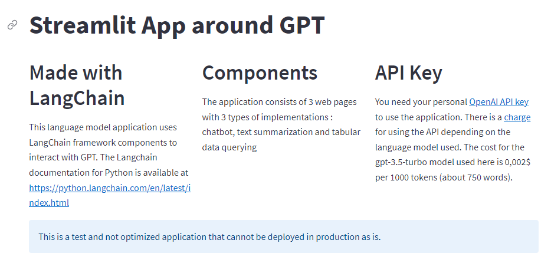

# Streamlit app for testing AI Assistant with GPT and LangChain framework


## Use cases



## Online Access on Streamlit Cloud

The app has been deployed on the community Streamlit Cloud and is reachable at this url : [https://gegedenice-streamlitcloud-gpt-experimentations-about-y7jwfv.streamlit.app/](https://gegedenice-streamlitcloud-gpt-experimentations-about-y7jwfv.streamlit.app/)

## Local installation

### Python environment

```
git clone https://github.com/azur-scd/streamlit-gpt-experimentations.git
cd streamlit-gpt-experimentations
pip install -r requirements.txt
streamlit run About.py
```

Open https://localhost:8051/streamlit-gpt-experimentations

### Docker environment 1/2

A docker image is avalaible in the Docker registry at [https://hub.docker.com/repository/docker/azurscd/streamlit-gpt](https://hub.docker.com/repository/docker/azurscd/streamlit-gpt)

```
docker run --name YOUR_CONTAINER_NAME -p 8051:8051 azurscd/streamlit-gpt:latest
```

Open https://localhost:8051/streamlit-gpt-experimentations

### Docker environment 2/2

You can also build your own image starting from the source code as follows

```
git clone https://github.com/azur-scd/streamlit-gpt-experimentations.git
cd streamlit-gpt-experimentations
docker build -t YOUR_IMAGE_NAME .
docker run -d --name YOUR_CONTAINER_NAME -p 8051:8051 -v YOUR_PATH/streamlit-gpt-experimentations:/app YOUR_IMAGE_NAME
```


